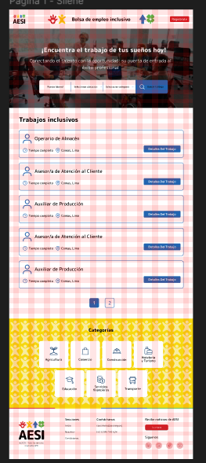
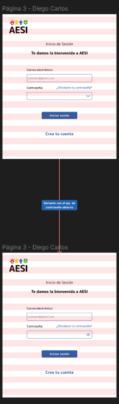

# 💼 AESI - Bolsa de Empleo (UI/UX)

> **Diseño de Interfaz** para una plataforma de reclutamiento que conecta talento con empresas.

## 📖 Descripción
Plataforma dual diseñada para facilitar el proceso de contratación:
1.  **Candidatos:** Búsqueda de ofertas, gestión de perfil y seguimiento de postulaciones.
2.  **Administradores/Reclutadores:** Publicación de vacantes y filtrado de postulantes.

## 📸 Galería del Diseño

### 1. Portal del Candidato
Experiencia de usuario fluida para encontrar trabajo.

| Inicio / Landing | Login | Perfil (Mi Cuenta) |
|:---:|:---:|:---:|
|  |  |  |

| Ver Empleo | Mis Postulaciones |
|:---:|:---:|
|  |  |

### 2. Portal del Administrador
Herramientas de gestión para reclutadores.

| Crear Oferta | Ver Ofertas | Ver Postulante |
|:---:|:---:|:---:|
|  |  |  |

---
*Diseñado por Jireh Aroni*
